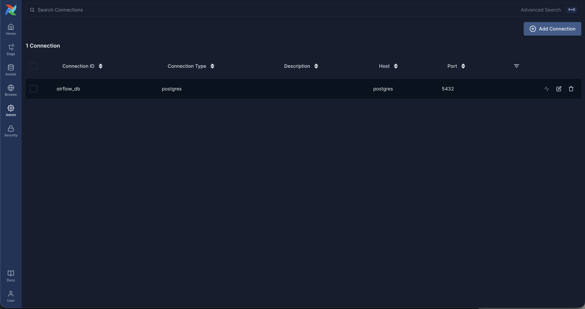
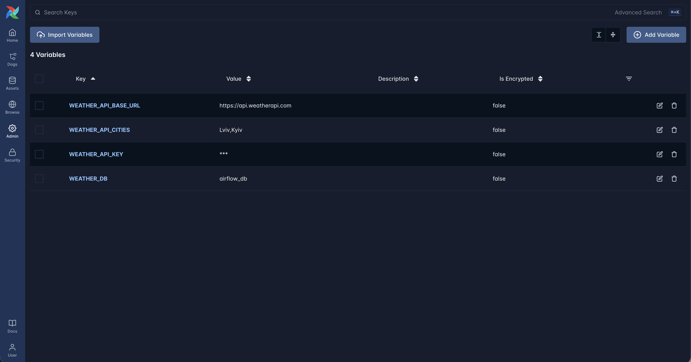
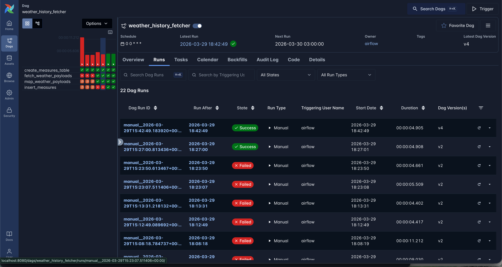
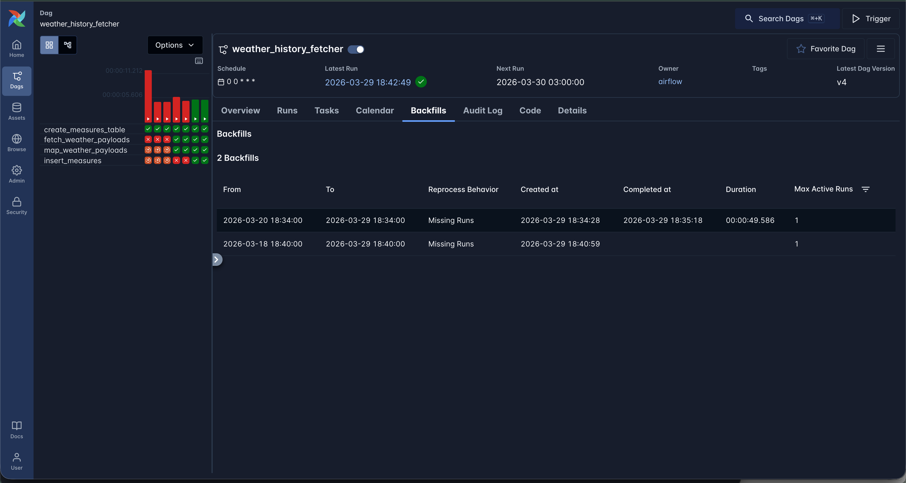
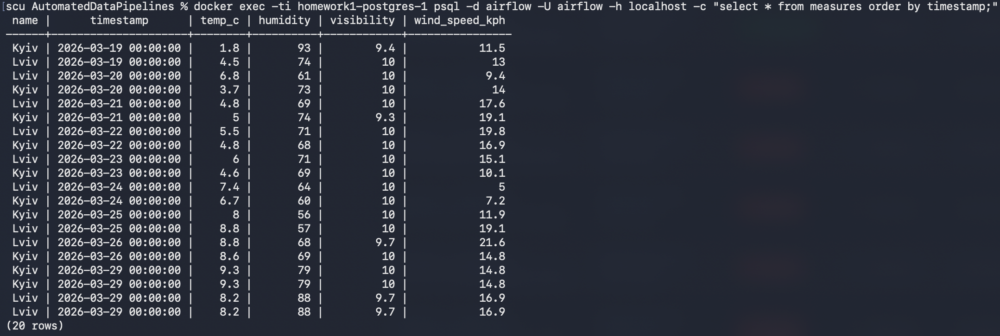

# Homework 1

I couldn't register at https://openweathermap.org because of errors on the website.

So I used another weather API: https://www.weatherapi.com/.

Swagger: https://app.swaggerhub.com/apis-docs/WeatherAPI.com/WeatherAPI/1.0.2#/

### Airflow run
I ran Airflow 3 in Docker by following the instructions from the official [documentation](https://airflow.apache.org/docs/apache-airflow/stable/howto/docker-compose/index.html).

### DB connection

DB connection configuration in the Airflow UI

### Environment variables

Env vars in the Airflow UI

### DAG

The DAG source code can be found in [weather_dag.py](./dags/weather_dag.py).

### Execution

DAG executions while testing the logic

Backfill DAG executions

DB data after backfill

