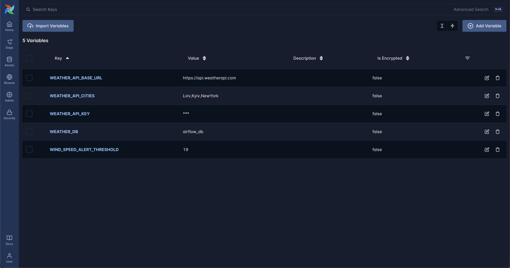
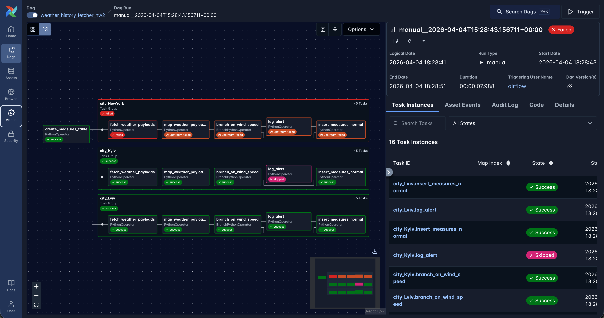
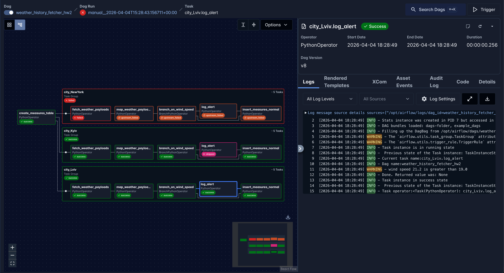
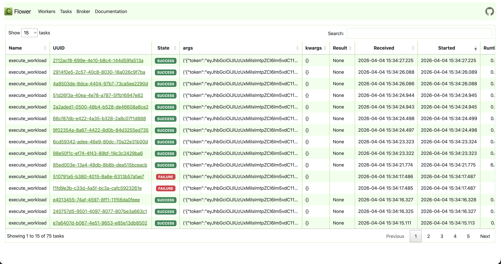
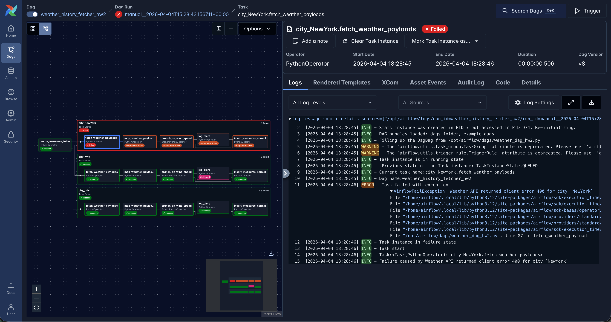

# Homework 2

I couldn't register at https://openweathermap.org because of errors on the website.

So I used another weather API: https://www.weatherapi.com/.

Swagger: https://app.swaggerhub.com/apis-docs/WeatherAPI.com/WeatherAPI/1.0.2#/

### Airflow run
I ran Airflow 3 in Docker by following the instructions from the official [documentation](https://airflow.apache.org/docs/apache-airflow/stable/howto/docker-compose/index.html).

### DB connection

<details>
<summary>DB connection configuration in the Airflow UI</summary>


</details>

### Environment variables

<details>
<summary>Env vars in the Airflow UI</summary>


</details>

### DAG

The DAG source code can be found in [weather_dag_hw2.py](./dags/weather_dag_hw2.py).

### Execution

#### Wrap each city's tasks in a TaskGroup (extract -> transform -> load)
For each city provided in the env variable a [TaskGroup](./dags/weather_dag_hw2.py#L192) is created

#### Use XComs to pass data between fetch/transform/load tasks instead of any shared state
XComs are used to pass data between tasks.

- [Pushing](./dags/weather_dag_hw2.py#L83) data on a successful API call
- [Pulling](./dags/weather_dag_hw2.py#L103) data on mapping response
- [Pushing](./dags/weather_dag_hw2.py#L117) mapped result
- [Pulling](./dags/weather_dag_hw2.py#L121) mapped result to store in DB

#### Add a BranchOperator after transformation that checks if any metric (for example, wind speed) crosses a threshold and routes to either a "normal load" or "alert + load" path
[BranchOperator](./dags/weather_dag_hw2.py#L225) switches between a normal DB update and an alert (logging message) with the following a normal DB update.\
The wind speed threshold is taken from the [env](#environment-variables) variable.
<details>
    <summary>Branching example</summary>


</details>
<details>
    <summary>Alert message</summary>


</details>

#### Switch to Celery executor (provide screenshot of flower monitoring tool)
Celery is enabled by using the env variable in the official docker-compose file.
```shell
AIRFLOW__CORE__EXECUTOR: CeleryExecutor
```
Additionally, the flower monitoring tool is enabled by using the `--profile flower` flag.

```shell
docker compose --profile flower up
```
<details>
    <summary>Flower</summary>


</details>

#### Add retry logic and error handling
PythonOperator extends the BaseOperator, which provides [retry logic](https://airflow.apache.org/docs/task-sdk/3.1.8/api.html#airflow.sdk.BaseOperator) and error handling.\
So, the [PythonOperator](./dags/weather_dag_hw2.py#L197), which calls the Weather API, is configured to retries with exponential backoff.\
Error handling is done in the [fetch_weather_payload](./dags/weather_dag_hw2.py#L) method.\
Any 4xx http status code is considered an error, and non-retriable [AirflowFailException](https://airflow.apache.org/docs/apache-airflow/3.1.8/_api/airflow/exceptions/index.html) is throws.\
Any 5xx http status code is considered to be retriable, so AirflowException is thrown.

It's hard to simulate a 5xx error, so here is an example of a non-retriable error.
<details>
    <summary>Non-retriable example</summary>


</details>