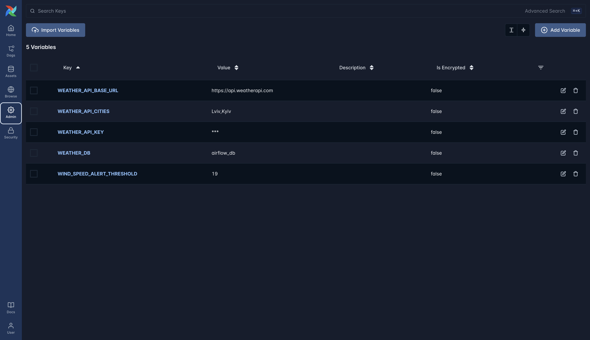
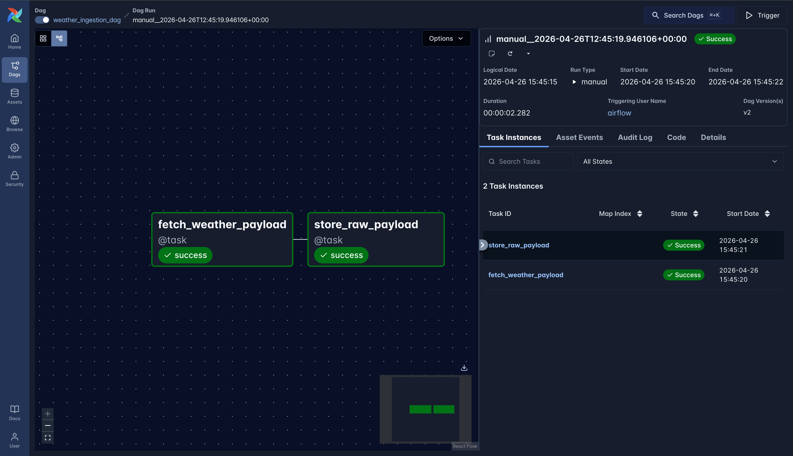
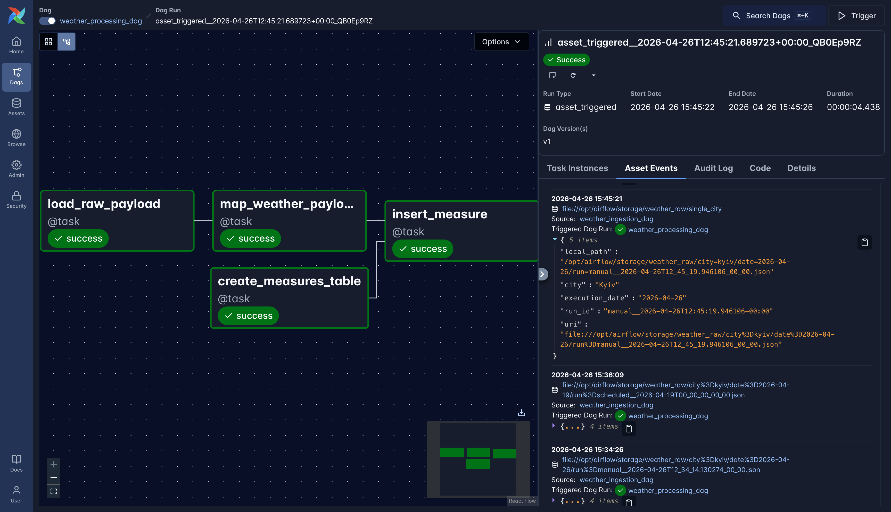
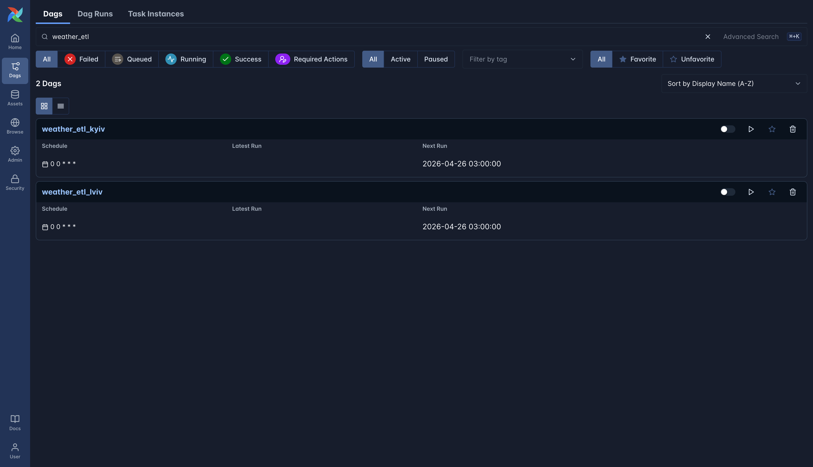
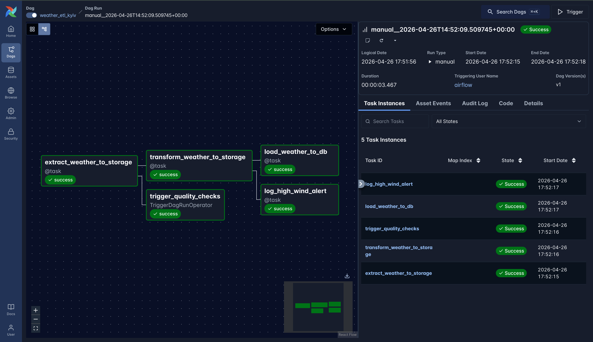
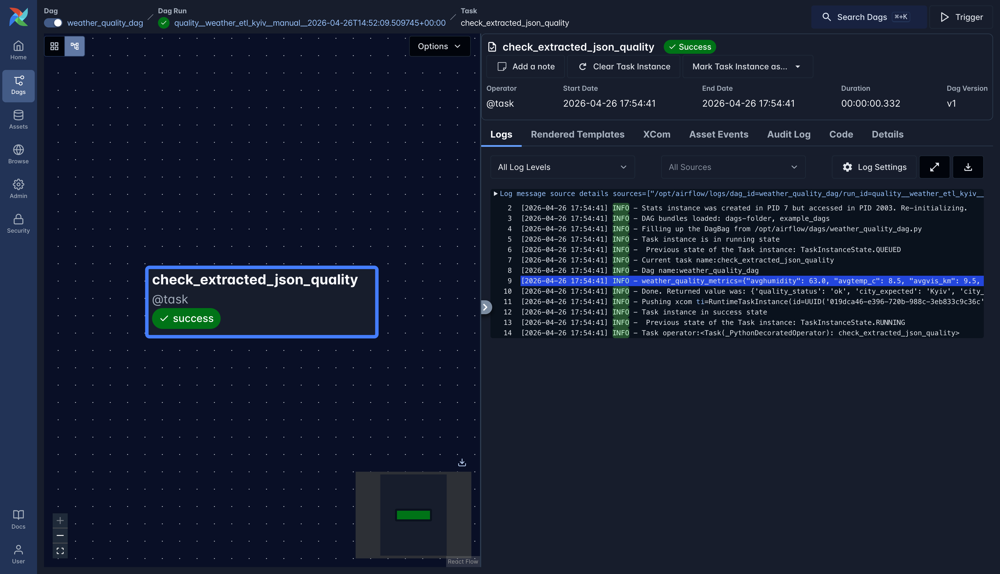
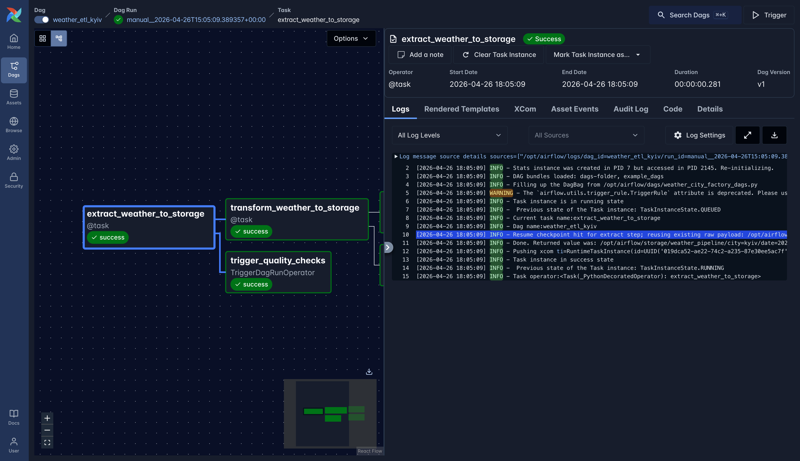
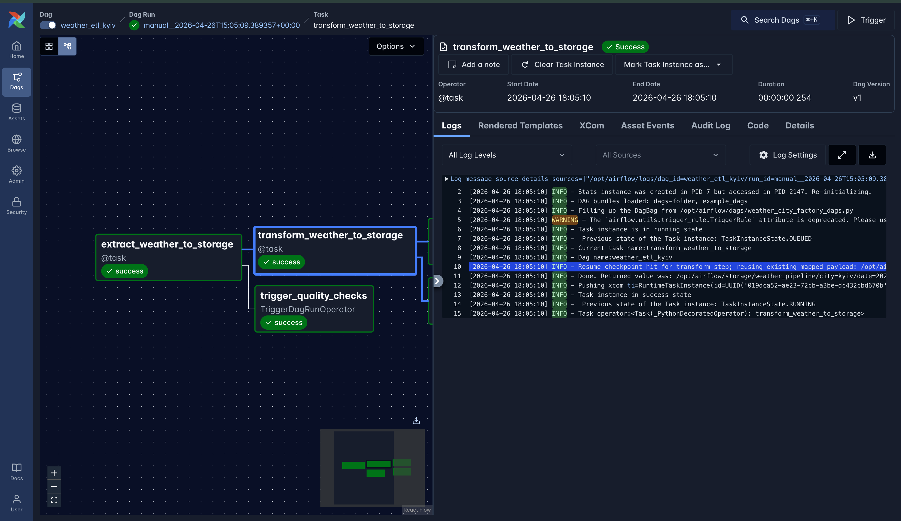
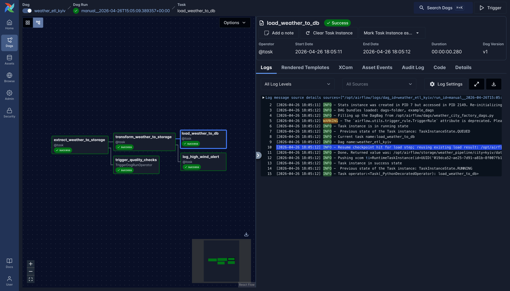
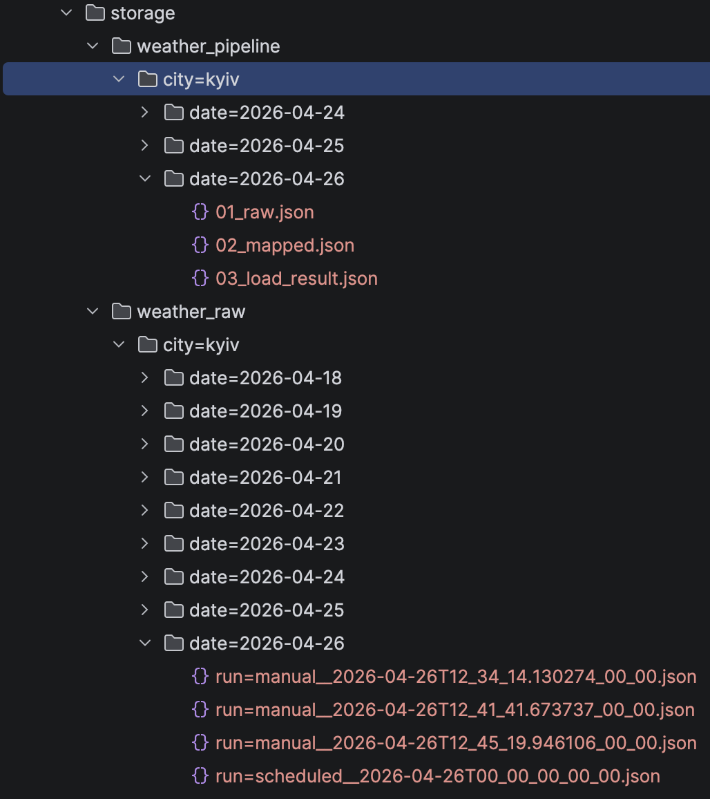

# Homework 3

I couldn't register at https://openweathermap.org because of errors on the website.

So I used another weather API: https://www.weatherapi.com/.

Swagger: https://app.swaggerhub.com/apis-docs/WeatherAPI.com/WeatherAPI/1.0.2#/

### Airflow run
I ran Airflow 3 in Docker by following the instructions from the official [documentation](https://airflow.apache.org/docs/apache-airflow/stable/howto/docker-compose/index.html).

**Additionally**, I mounted a storage volume to have an external storage for the DAGs.
### DB connection

<details>
<summary>DB connection configuration in the Airflow UI</summary>


</details>

### Environment variables

<details>
<summary>Env vars in the Airflow UI</summary>


</details>

## Cross-Dag dependencies

I used a mounted volume to store fetched data from the API to share it between the DAGs.
Jinja templates are used for the input parameters.

### DAG

The DAG source code can be found in 
 - [ingestion](./dags/weather_ingestion_dag.py)
 - [processing](./dags/weather_processing_dag.py)

### Execution

<details>
<summary>Ingestion</summary>


</details>

<details>
<summary>Processing</summary>


</details>

## ETL


### DAG

The DAG source code can be found in
- [factory](./dags/weather_city_factory_dags.py)
- [quality check](./dags/weather_quality_dag.py)

### Execution

<details>
<summary>Factory created DAGs</summary>


</details>

<details>
<summary>Kyiv ETL</summary>


</details>

<details>
<summary>Quality check</summary>



```json
{
  "avghumidity": 63.0,
  "avgtemp_c": 8.5,
  "avgvis_km": 9.5,
  "checks": {
    "city_match": true,
    "date_match": true,
    "humidity_range_0_100": true,
    "temperature_reasonable_minus90_65": true,
    "visibility_non_negative": true,
    "wind_non_negative": true
  },
  "city_expected": "Kyiv",
  "city_payload": "Kyiv",
  "execution_date_expected": "2026-04-26",
  "execution_date_payload": "2026-04-26",
  "failed_checks": [],
  "forecast_days_count": 1,
  "maxwind_kph": 34.6,
  "payload_size_bytes": 18737,
  "quality_status": "ok"
}
```
</details>

### Resume
<details>
<summary>Extract</summary>


</details>
<details>
<summary>Transform</summary>


</details>
<details>
<summary>Load</summary>


</details>

### Storage structure
<details>
<summary>Result</summary>


</details>
