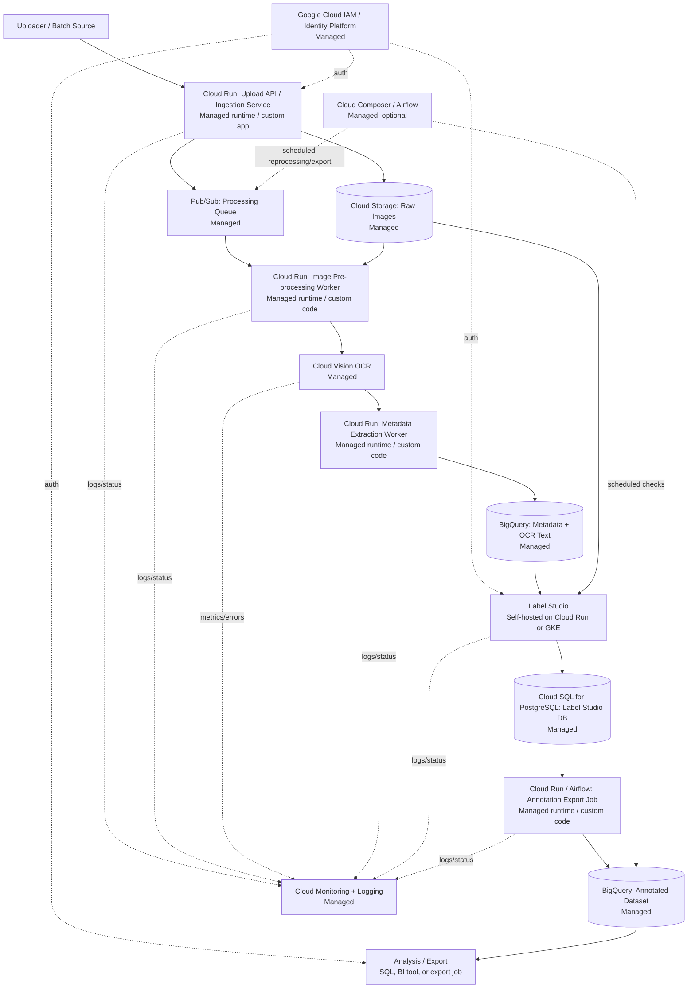

# Final Solution Diagram

The final design uses a Google Cloud-centered hybrid architecture. Managed Google Cloud services are used for identity, storage, queueing, processing, OCR, analytics, and monitoring. Label Studio is self-hosted inside the same cloud environment for human annotation.

## Service Choices

| Pipeline Component | Concrete Service | Managed / Self-hosted | Justification |
|---|---|---|---|
| Identity and access control | Google Cloud IAM / Identity Platform, optionally Identity-Aware Proxy for web apps | Managed | Provides centralized access control for uploaders, reviewers, analysts, administrators, and service accounts. |
| Ingestion service | Custom upload API on Cloud Run | Managed runtime / custom app | Handles manual and batch image upload, file validation, material ID assignment, and technical metadata capture. User access can be protected through Google identity, for example Identity Platform or Identity-Aware Proxy, while service-to-service access uses IAM service accounts. |
| Raw file storage | Cloud Storage | Managed | Preserves original `JPG`, `JPEG`, and `PNG` files unchanged for audit and reprocessing. |
| Processing queue | Pub/Sub | Managed | Decouples upload from processing and supports batch ingestion peaks. |
| Image pre-processing | Cloud Run worker | Managed runtime / custom code | Normalizes image orientation, resolution, or contrast before OCR. |
| OCR | Cloud Vision OCR | Managed | Provides managed image OCR with Ukrainian language support for searchable text extraction. |
| Metadata extraction | Cloud Run worker | Managed runtime / custom code | Extracts simple metadata from OCR text, such as language, phone or website, and discount or price information. |
| Structured metadata storage | BigQuery | Managed | Stores OCR text, extracted metadata, processing status, and analysis-ready records. |
| Annotation interface | Label Studio hosted on Cloud Run or GKE | Self-hosted app on managed infrastructure | Supports manual annotation of `creative_format`, `creative_intent`, and `industry` without building a custom labeling UI. OCR output is shown as supporting context, but final labels are assigned by reviewers. Access should be protected with Google IAP or Label Studio Enterprise SSO, with reviewer/admin roles managed inside the application. |
| Annotation operational storage | Cloud SQL for PostgreSQL | Managed | Stores Label Studio application state, annotation tasks, users, and draft/review data separately from the analysis-ready dataset. |
| Annotation export job | Cloud Run job or Airflow DAG | Managed runtime / custom code | Exports reviewed annotations from Label Studio operational storage/API into BigQuery for analysis. |
| Annotated dataset storage | BigQuery | Managed | Stores final labels and makes the annotated dataset queryable/exportable for analysis. |
| Monitoring and logging | Cloud Monitoring + Cloud Logging | Managed | Tracks processing status, errors, OCR failures, latency, and annotation backlog. |
| Scheduled reprocessing and exports | Cloud Composer / Airflow | Managed, optional | Runs scheduled DAGs for backfills, reprocessing, exports, and data quality checks without forcing Airflow into the event-driven ingestion path. |

## Notes

- The main ingestion and processing path is event-driven: upload, queue, pre-process, OCR, metadata extraction, annotation, and analysis.
- The ingestion service is not a prebuilt product in this design. It is a small custom upload API deployed on Cloud Run. The managed part is the runtime, autoscaling, deployment, and integration with Google Cloud IAM, Cloud Storage, Pub/Sub, and Cloud Logging.
- OCR and annotation are separate steps. OCR extracts text from images; Label Studio is used for human annotation of creative labels.
- Label Studio keeps its operational state in Cloud SQL. BigQuery remains the analysis-ready store, so reviewed labels are exported or synchronized from Label Studio into BigQuery.
- Google Cloud services use IAM roles and service accounts for RBAC and service-to-service permissions. Human-facing apps such as the upload API, Label Studio, and analysis access should use Google-managed identity controls where possible.
- Label Studio is the main caveat: open-source Label Studio can be protected at the perimeter with Google Identity-Aware Proxy and can use its own application roles, while Enterprise SSO/RBAC is a cleaner option if strict centralized role management is required.
- Airflow is optional and used only where it fits naturally: scheduled jobs, reprocessing, backfills, exports, and data quality checks.
- Reprocessing can be implemented as an Airflow DAG that selects materials from BigQuery by status, date range, OCR version, or failed processing state, then republishes their material IDs to Pub/Sub for the same Cloud Run workers to process again.
- Data quality checks can be implemented as scheduled Airflow tasks that run BigQuery SQL checks, for example missing OCR text, invalid annotation labels, high OCR failure rate, or materials stuck in `pending` status for too long.
- Exports can be implemented as scheduled Airflow tasks that write curated BigQuery tables or CSV/Parquet exports to Cloud Storage for analysts or downstream tools.
- AWS Textract is not selected because Ukrainian OCR support is required.
- Document AI is not selected for the first version because the current scope needs general image OCR, not layout-aware document extraction.
