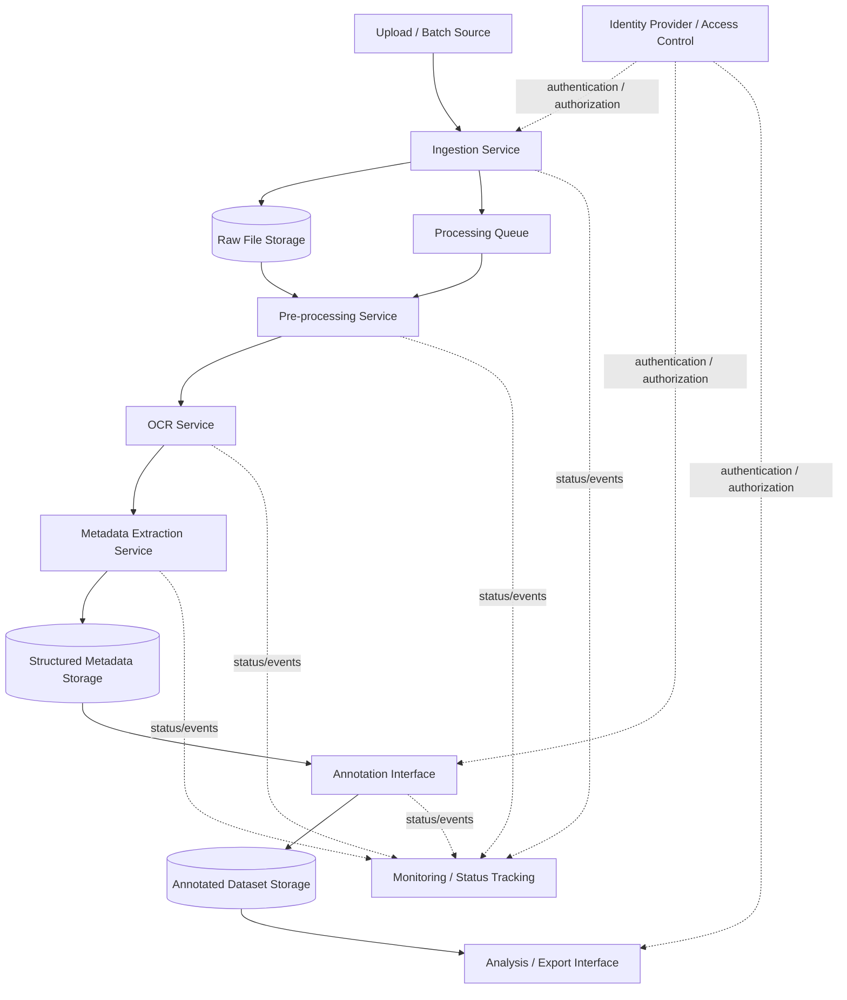

# Raw Solution Diagram

This diagram uses generic component names and does not include vendor or technology choices.

## Data Flow

1. Direct marketing materials are uploaded manually or through a batch source.
2. The ingestion service validates the file, assigns a material ID, and captures technical metadata.
3. The original file is stored unchanged in raw file storage.
4. A processing job is added to the processing queue.
5. The pre-processing service prepares the single-page image for OCR.
6. The OCR service extracts text from the material.
7. The metadata extraction service extracts simple metadata from OCR text.
8. Structured metadata, OCR text, and processing status are stored.
9. Human reviewers use the annotation interface to assign creative format, creative intent, and industry labels.
10. Final annotations are stored in the annotated dataset storage.
11. Analysts can query or export the annotated dataset for analysis.
12. Pipeline components send status and error events to monitoring/status tracking.
13. Access to ingestion, annotation, and analysis interfaces is controlled through a central identity and access control component.
